<p align="center">

</p>

<h1 align="center">Boundary First Flattening (BFF)</h1>

Boundary First Flattening (BFF) is a free and open source application for surface parameterization. Unlike other tools for UV mapping, BFF allows free-form editing of the flattened mesh, providing users direct control over the shape of the flattened domain&mdash;rather than being stuck with whatever the algorithm provides. The initial flattening is fully automatic, with distortion mathematically guaranteed to be as low or lower than any other conformal mapping tool. The tool also provides some state-of-the art flattening techniques not available in standard UV mapping software such as <em>cone singularities</em>, which can dramatically reduce area distortion, and <em>seamless maps</em>, which help eliminate artifacts by ensuring identical texture resolution across all cuts. BFF is highly optimized, allowing interactive editing of meshes with millions of triangles.

The BFF application is based on the paper, <em>"<a href="http://www.cs.cmu.edu/~kmcrane/Projects/BoundaryFirstFlattening/paper.pdf">Boundary First Flattening"</a></em> by <a href="http://rohansawhney.io">Rohan Sawhney</a> and <a href="http://www.cs.cmu.edu/~kmcrane/">Keenan Crane</a>.


# Features

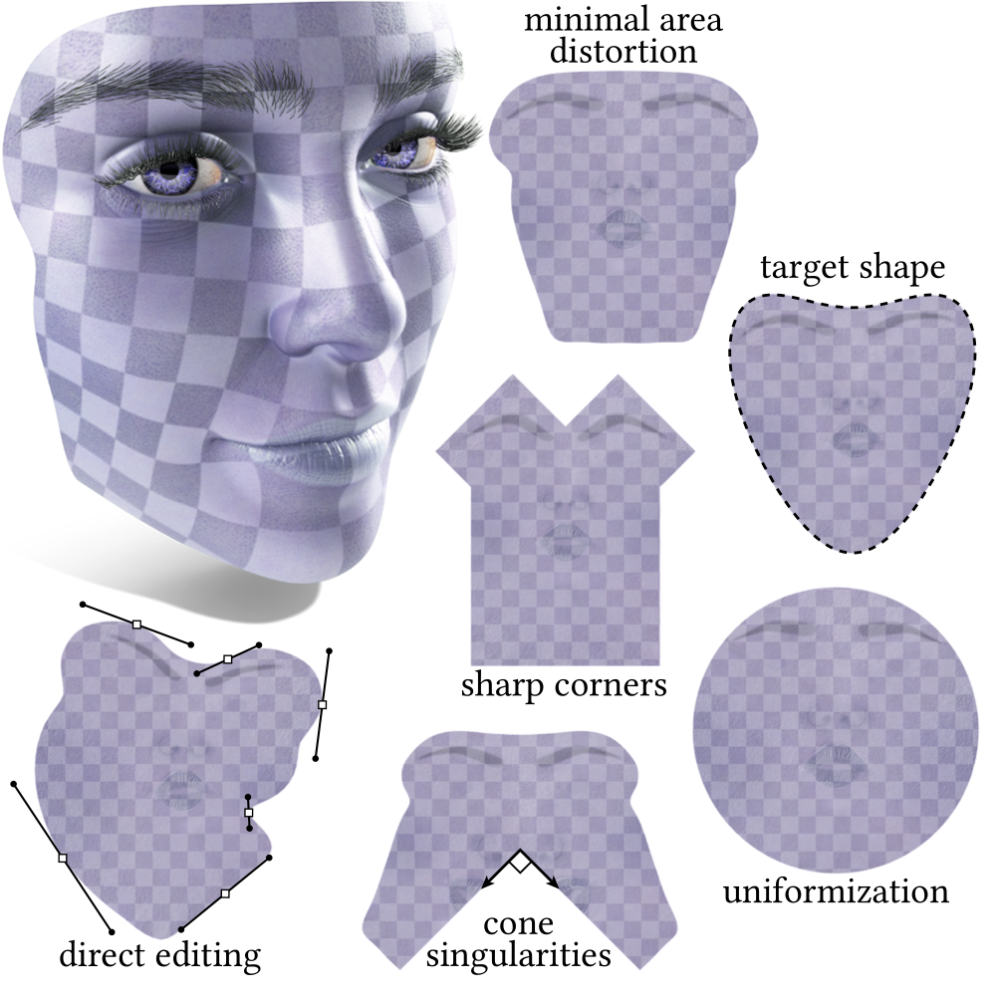

1. Automatic parameterization with minimal area distortion. This map is generated by default when the application is launched.

2. Direct manipulation of boundary lengths or angles of the flattened domain with a spline based curve editor.

3. Exact preservation of sharp corners for flattened domains like rectangles.

4. Seamless cone parameterization. This is a powerful technique for mitigating area distortion that first maps to a cone surface, which is flat everywhere except at a collection of isolated points. After cutting through these points, the cone surface is flattened into the plane without further distortion. Users can pick cones manually or use a built in algorithm to pick them automatically. Cutting is automatic.

5. Mapping to a unit disk for surfaces with boundary.

6. Mapping to a unit sphere for sphere like surfaces.

# Download Application

>    [Mac OSX v1.5](https://github.com/GeometryCollective/boundary-first-flattening/releases/tag/v1.5)<br/>
>    [Windows v1.5](https://github.com/GeometryCollective/boundary-first-flattening/releases/tag/v1.5)

# Release History

* **v1.0** (December 2017) &mdash; Initial release.
* **v1.1** (January 2019) &mdash; Adds support for arbitrary topology (holes, handles, <em>etc.</em>; not just disk and sphere), quad and polygon meshes, command-line interface with no GUI build dependencies, and 3x overall speedup across load/solve/write operations.
* **v1.2** (June 2019) &mdash; Ensures that vertex ordering in the input/output meshes agree; accelerates cone computation for surfaces with boundary; minor accelerations and bug fixes.
* **v1.3** (August 2019) &mdash; Adds support for tighter bin packing; ensures vertex ordering is preserved; more error logging and bug fixes.
* **v1.4** (June 2020) &mdash; Improved spherical parameterization; bin packing related bugfixes and more efficient loading of models with many components.
* **v1.5** (March 2023) &mdash; Updated dependencies; restructured project to avoid include conflict; option to export UVs as mesh positions in OBJ file.
* **v1.6** (May 2023) &mdash; Support for non-manifold geometry; increased robustness to low quality triangulations; improved hole filling, packing efficiency and GUI load times; USD support.

# Tutorial

<p align="center">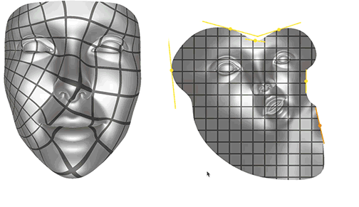</p>

BFF should be fairly intuitive to use, so go ahead and give it a try! If you find you still have questions, the tutorial below may provide some useful guidance. (<em>Warning:</em> As with most tutorials, this one may not be in sync with the latest software version. Read at your own risk! ;-))

BFF can be run either from the command line, which provides automatic parameterization and some basic operations, or in an interactive GUI, which provides additional operations and editing capabilities.  Either tool loads a polygon mesh in OBJ or USD format, and produces a flattened mesh (also in OBJ or USD format). Meshes with (and without) boundary, holes, handles, multiple components and <a href="http://15462.courses.cs.cmu.edu/fall2017/lecture/meshesandmanifolds/slide_013">non-manifold connectivity</a> are supported. Meshes that do not have disk or sphere topology will be automatically cut for flattening.

<p align="center">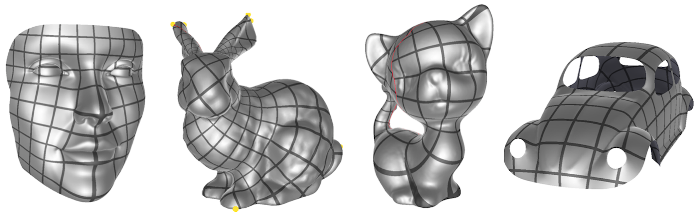</p>
<p align="center">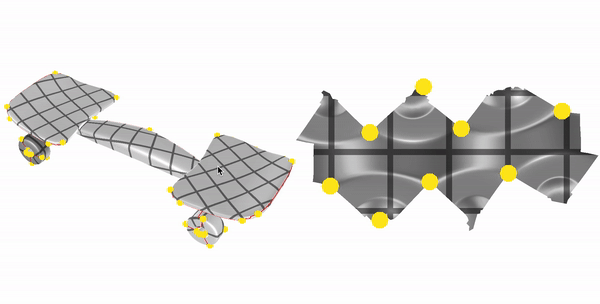</p>

## Interactive Graphical Interface

Initially, the GUI should look something like this:

<p align="center">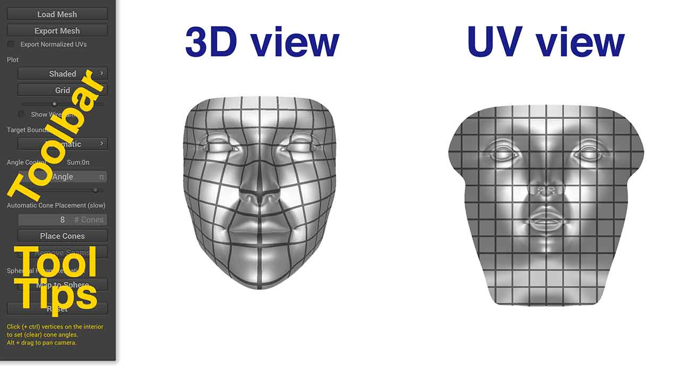</p>

The <b>3D View</b> shows the original mesh, the <b>UV view</b> shows the current flattening. Since BFF is incredibly fast, you <em>do not have to take any action</em> to get an updated flattening; the UV view will be automatically refreshed whenever you click on a button or other UI element. The <b>Toolbar</b> provides various options for flattening the surface; pay close attention to the <b>Tool Tips</b>, which can provide useful information about the currently selected tool. By default, the UV map is visualized as a grid on the surface; the shading on the surface is also used to light the UV map, to give a sense of correspondence between 3D and 2D. Additional visualization options are described below.

Finally, the <b>Reset</b> button will set the current tool (and the corresponding flattening) back to its default parameters. New meshes can be loaded by pressing the <b>Load Mesh</b> button; the <b>Export Mesh</b> button allows a mesh to be exported to OBJ format, with the texture coordinates stored in the <tt>vt</tt> field (one per distinct triangle corner in the flattened mesh).

### Adjusting the View

The view can be independently adjusted in both the <b>3D view</b> and the <b>UV view</b>. In particular:

<ul>
<li><em>rotate</em> &mdash; click and drag on any point in the background (not on the mesh)</li>
<li><em>translate</em> &mdash; alt/option-click on the background</li>
<li><em>zoom in/out</em> &mdash; scroll up/down</li>
</ul>

### Visualization Options

In addition to visualizing the map itself, BFF provides facilities for inspecting the quality of the map. The <b>Shading Menu</b> (first menu in the <b>Plot</b> section) provides the following options:

<p align="center">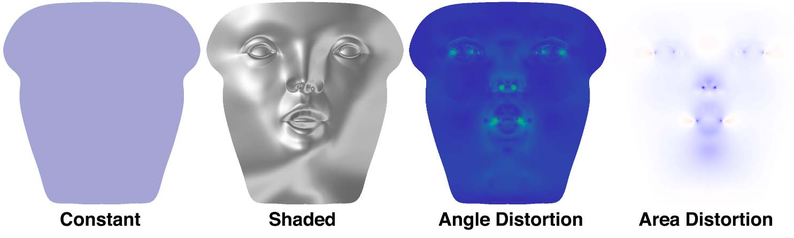</p>

<ul>
<li><em>Constant</em> &mdash; no special shading; useful for looking at the wireframe or checking for local overlaps. In this view, flipped triangles (which are fairly rare) will be drawn in bright red.</li>
<li><em>Shaded</em> &mdash; the mesh in the UV view will be lit using the shading from the 3D view. This shading gives a quick way to see which features get mapped where.</li>
<li><em>Conformal Distortion</em> &mdash; shows angle distortion in the mapping. Blue means no angle distortion, green means a little angle distortion, and red means a lot of angle distortion. For reasonably nice meshes (e.g., smallish triangles, not too crazy aspect ratios) you should see very little angle distortion. Large angle distortion on simple models may indicate that there is something wrong with your mesh (e.g., long invisible slivers or near-degenerate elements). In this mode, the total angle distortion will be printed out above the <b>Shading Menu</b> (this quantity is the average and maximum <em>quasi conformal distortion</em>, where 1 means no distortion).</li>
<li><em>Area Distortion</em> &mdash; shows how much area is distorted by the mapping. White means no area distortion, blue means shrinking, and red means expansion. In this mode, the total area distortion will be printed out above the <b>Shading Menu</b> (this quantity is the average and maximum <em>log conformal factor</em>, where zero means no distortion).</li>
</ul>

The <b>Pattern Menu</b> draws different patterns on the surface. These patterns have been chosen to give a sense of the angle and area distortion in the flattening. For a perfect map (<em>i.e.,</em> no distortion at all) the pattern should look uniform in scale across the whole surface, and circles and squares in the UV view should look like circles and squares in the 3D view (taking perspective distortion into account). These features will give you a sense of how textures and other data will look when mapped onto the surface. In particular:

<p align="center">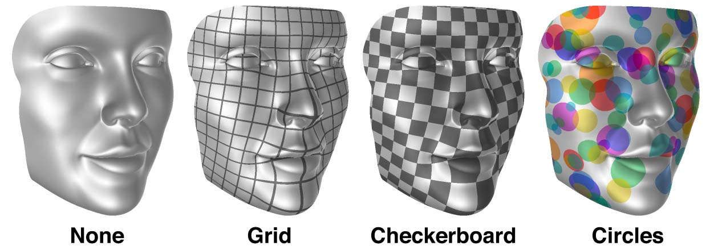</p>

<ul>
<li><em>None</em> &mdash; no pattern is displayed. Useful for getting a clear view of other features of the map (<em>e.g.,</em> area distortion, or the wireframe).</li>
<li><em>Grid</em> &mdash; draws a regular grid pattern. (Note that for maps with cones or cuts, grid lines will line up exactly only if the map is made seamless.)</li>
<li><em>Checkerboard</em> &mdash; draws a regular checkerboard pattern. (Note that even for seamless maps there may be a jump from black to white, due to parity considerations.)</li>
<li><em>Circles</em> &mdash; draws random circles. For a map with low angle distortion, these circles should still look like circles (rather than ellipses) on the 3D surface.</li>
</ul>

The <b>Pattern Scale Slider</b>, found directly below the <b>Pattern Menu</b>, will adjust the scale of the pattern. Such adjustment can be useful for, <em>e.g.,</em> understanding what's going on in a map with high area distortion.

<p align="center"></p>

The <b>Show Wireframe</b> checkbox toggles display of a wireframe over the mesh edges, which can be helpful for visualizing the map.

<p align="center">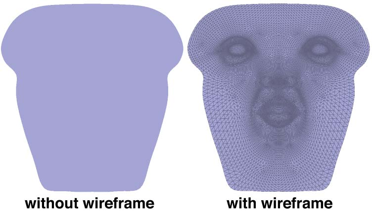</p>

## Target Boundary

A key functionality provided by BFF is the ability to change the target shape of the flattening, by manipulating its boundary curve. No matter what target shape is used, BFF will tend to reduce a map with very low distortion, so that textures and other data can still be nicely mapped back onto the original surface. Several possibilities are accessible through the graphical interface (and additional possibilities are available through source code-level access):

<p align="center">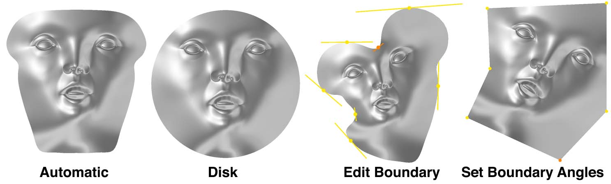</p>

<ul>
<li><em>Automatic</em> &mdash; if no special control over the boundary is required, BFF automatically produces the flattening with minimal area distortion. (Note that since we mathematically guarantee that this is the lowest area distortion, it is not possible to reduce area distortion by using different flattening software. However, area distortion <em>can</em> be reduced by adding cuts and cone singularities; see below.)</li>
<li><em>Disk</em> &mdash; maps the surface to a circular disk. This map provides an easy way to get a map between two different surfaces (<em>e.g.,</em> two different faces): just map each surface to the disk independently, then to locate a point in the 2nd mesh corresponding to a given point on the 1st mesh, follow the maps from the 1st surface, to the disk, and then back to the 2nd surface. (Expert comment: there are <em>M&ouml;bius</em> degrees of freedom that are not exposed by the GUI; direct control over these degrees of freedom may be supported in a future release.)</li>
<li><em>Edit Boundary</em> &mdash; provides direct manipulation of the boundary curve using a user-specified spline. Control points can be added (or removed) by clicking (or ctrl-clicking) points on the boundary. Clicking and dragging on a handle will change the scale; holding shift will control the angle instead of the scale.</li>
<li><em>Set Boundary Angles</em> &mdash; allows the corner angles of a polygon to be specified. Angles can be specified using the <b>Angle Control</b> slider, or by typing in the angle box (where the value is interpreted as a multiple of &pi;). As with any polygon, these angles must of course sum to 2&pi;&mdash; the GUI will automatically adjust the angles to preserve this sum at all times, by adjusting the angle at the corner that was least-recently updated.</li>
</ul>

## Cone Singularities

In general, it is impossible to flatten a surface perfectly. Somewhere, there <em>must</em> be distortion of either angles or areas. BFF can produce flattenings with minimal area distortion and virtually zero angle distortion, but in some situations area distortion is still too high for practical use. One solution is to cut the mesh into smaller pieces, each of which is easier to flatten, but typically this is unnecessarily aggressive. One can instead reduce distortion to more reasonable levels by inserting <em>cone singularities</em>, which play much the same role as &ldquo;darts&rdquo; in garment design. The BFF GUI makes it easy to explore the effect of placing cones, and also provides the ability to place cones automatically in order to reduce area distortion.

### Manual Cone Placement

The easiest way to add cones is simply to click on any point of the surface in either the <b>3D View</b> or <b>UV View</b> while the target boundary is set to <b>Automatic</b> or <b>Disk</b>. Doing so will insert a cone at the click location, find a cut from this cone to the boundary, and update the flattening. Additional clicks will add additional cones. To see the effect on area distortion, set the plot mode to <b>Area Distortion</b>, which will show the distribution of area distortion over the surface (as described above). Clicking on regions of high area distortion will tend to reduce it. Drawing a pattern (such as grid or checkerboard) will also provide some sense of how much scale distortion remains. Note that a <em>poor</em> choice of cones can actually <em>increase</em> area distortion&mdash; some experimentation may be required here. Alternatively, one can try the automatic placement button, as described below. (Cuts are picked automatically in the GUI; the cutting strategy can currently only be changed via source-level modifications to BFF.)

<p align="center">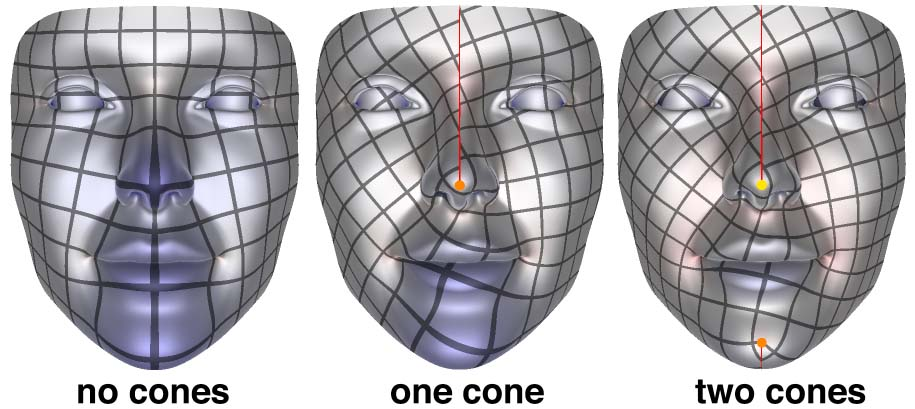</p>

The <b>Angle Control</b> slider allows the cone angle to be adjusted; alternatively, one may type in a specific cone angle (as a multiple of &pi;). The cone angle can be understood in analogy with &ldquo;darts&rdquo; in dressmaking: smaller angles will typically accommodate less curvature; large angles are helpful for highly curved regions. For spherical surfaces (with no boundary) the total angle sum must be 4&pi; at all times; the GUI will automatically adjust the least-recently updated cone to make sure this sum holds.

<p align="center">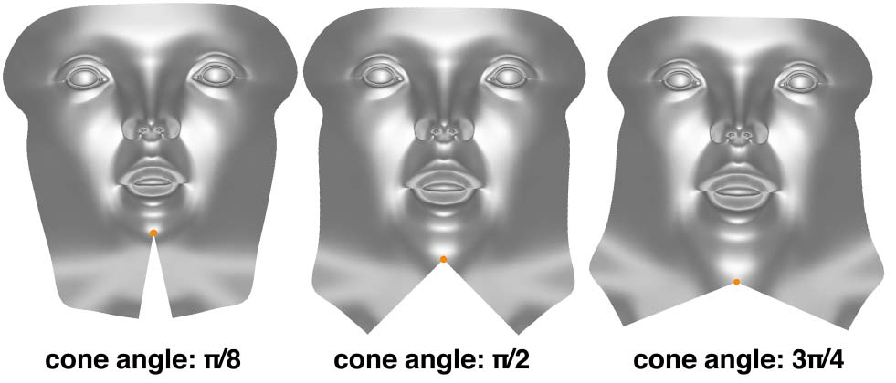</p>

### Automatic Cone Placement

A target number of cones can also be placed by simply pressing the <b>Place Cones</b> button. The number of cones can be specified in the <b># Cones</b> field. Note that computing these cones may take some time, especially for meshes with many boundary vertices. (This feature will be improved in future versions; stay tuned!)

<p align="center">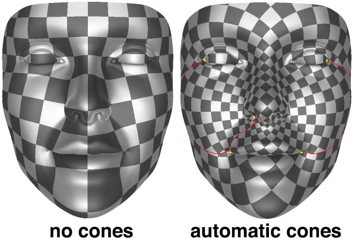</p>

### Seamless Maps (Coming soon!)

Placing cones will make cuts in the surface (indicated by red lines). By default, BFF already guarantees that the UV lengths of edges on either side of the cut is guaranteed to be exactly the same, so there is no jump in texture resolution across the cut. Likewise, the angle in UV space between two cut edges is exactly determined by the cone angle&mdash; for instance, if all cones angles are a multiple of &pi;/2 (<em>i.e.,</em> 90 degrees), then the edges will also be related by 90 degree rotations. To check this, set the drawing pattern to <b>Grid</b>. If all of your cone angles are multiples of &pi;/2, you should see that both the spacing and the direction of grid lines is unchanged as you go across a cut. However, you may also notice that grid lines shift left or right as you cross the cut, resulting in a visible seam. If the surface needs to be covered with a regular pattern (or tessellated into a regular grid), it can be useful to eliminate this seam, which you can do by pressing the <b>Remove Seams</b> button.</p>

<p align="center">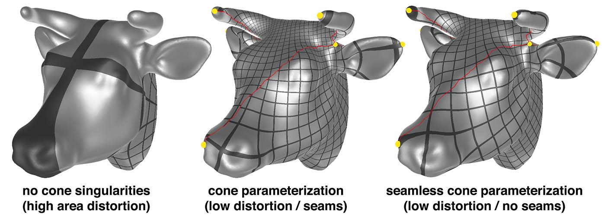</p>

## Spherical Parameterization

For sphere-like surfaces, BFF will also automatically produce a map to the sphere; simply press the <b>Map to Sphere</b> button. For maps to the sphere, there is less control that can be provided to the user since there is no boundary to edit! (Future versions may expose M&ouml;bius degrees of freedom, as with the disk.)

<p align="center"></p>

To get a map with lower area distortion, one can again add cone singularities (either automatically or manually) as described above. The surface will automatically be cut into a disk and flattened.

<p align="center">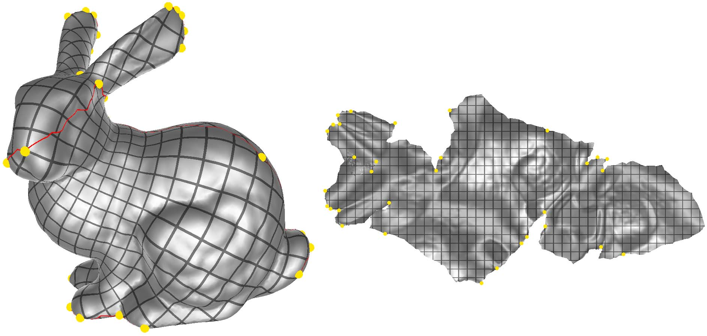</p>

# Compiling from source

On Mac OSX and Linux, compiling should be as simple as

```
git clone https://github.com/GeometryCollective/boundary-first-flattening.git
cd boundary-first-flattening && git submodule update --init --recursive
mkdir build && cd build && cmake ..
make -j4
```

These instructions will create both a command line and GUI application. On Windows, create a Visual Studio project with Cmake. The Windows binary shared above was built by linking with the version of
OpenBlas included in the deps folder. You will need to include the libopenblas.dll.a static library in your Visual Studio project.

# Dependencies

The command line version has the following dependencies:

1. [SuiteSparse](http://faculty.cse.tamu.edu/davis/suitesparse.html) (instructions to build SuiteSparse on Windows can be found [here](https://github.com/jlblancoc/suitesparse-metis-for-windows))

The GUI version also requires some additional dependencies:

2. OpenGL (version 4.1 or higher)
3. [OpenGL Mathematics (GLM)](http://glm.g-truc.net/0.9.8/index.html) (included but not required for command line application)
4. [Nanogui](https://github.com/wjakob/nanogui) (included but not required for command line application)

The command line and GUI applications both optionally support Pixar's [USD](https://www.pixar.com/usd) file format. To use this file format, provide the path to the USD install directory on your machine as input to cmake:
```
cmake -D USD_DIR=[PATH_TO_USD_DIR] ..
```

## Command Line Interface

The BFF code can be compiled and run independent of the GUI, for easy integration into other software packages / plugins.  To run the command line interface, simply navigate into the directory containing the executable `bff-command-line` and type

`./bff-command-line in.obj out.obj`

where `in.obj` is the mesh you want to flatten, and `out.obj` is the same mesh with the output UV coordinates.

Some optional flags:

* `--nCones=N_CONES` Use the specified number of cone singularities to reduce area distortion (these are chosen automatically).
* `--normalizeUVs` Scale all UVs so that they are in the range [0,1] x [0,1].
* `--writeOnlyUVs` Use the vertex flag 'v' in the [OBJ format](https://en.wikipedia.org/wiki/Wavefront_.obj_file) to store UVs (the 'vt' flag is used by default for OBJs, and primvars for USD files). 
* `--scaling` A multiplicative scale factor applied to each UV island in the texture atlas (default value is 1 indicating no scaling).
* `--mapToSphere` For a genus-0 surface (no holes, handles, or boundary), computes a flattening over the unit sphere rather than the plane. (See below for more detail.)
* `--flattenToDisk` For a topological disk, maps to the unit circular disk. (See below for more detail.)

Unlike the GUI, the command line application does not expose some of the interactive features of BFF such editing of boundary lengths, corner angles and cone angles.  These features can still be accessed via the code level interface (see below).

# Code level interface

All features of BFF can be accessed directly through a static library by compiling the code. The most important methods are described in <tt>include/bff/project/Bff.h</tt>. These methods assume that a standard triangle mesh has already been loaded into the <tt>Mesh</tt> object, and produce UV coordinates at the corners of each triangle, stored in the <tt>uv</tt> member of each element of <tt>Mesh::corners</tt>.

```
// Computes automatic flattening with minimal area distortion
//    -boundaryData stores either the target angles at boundary vertices (if
//     givenScaleFactors is false) -OR- the target scale factors (if givenScaleFactors
//     is true)
// (resulting flattening is stored in Corner::uv for each corner of this->mesh)
void BFF::flatten(DenseMatrix& boundaryData, bool givenScaleFactors);

// Computes flattening with prescribed cones
//    - the matrix C is just a Vx1 vector of cone angles (usually zero for most vertices)
//    - surfaceHasCut should be set to true if the locations of cones changed
// (resulting flattening is stored in Corner::uv for each corner of this->mesh)
void BFF::flattenWithCones(const DenseMatrix& C, bool surfaceHasNewCut);

// Uniformization over the unit disk
// (resulting flattening is stored in Corner::uv for each corner of this->mesh)
void BFF::flattenToDisk();

// Conformally maps a genus 0 mesh to a sphere
// (resulting flattening is stored in Corner::uv for each corner of this->mesh)
void BFF::mapToSphere();
```

# Authors
[Rohan Sawhney](http://www.rohansawhney.io)<br/>
[Keenan Crane](http://www.cs.cmu.edu/~kmcrane/)

# Citation

The BFF application implements the algorithm described in the paper:

>    **[Boundary First Flattening](https://arxiv.org/abs/1704.06873)**<br/>
>    Sawhney, Crane<br/>
>    ACM Transactions on Graphics

Our application builds on some terrific insights and work done on conformal flattening in recent years, including the automatic cone placement algorithm found in Ben Chen et al, <a href="http://www.cs.technion.ac.il/~gotsman/AmendedPubl/Miri/EG08_Conf.pdf">&ldquo;Conformal Flattening by Curvature Prescription and Metric Scaling&rdquo;</a> and the technique used to make maps globally seamless from Springborn et al, <a href="http://multires.caltech.edu/pubs/ConfEquiv.pdf">&ldquo;Conformal Equivalence of Triangle Meshes&rdquo;</a>. We are also indebted to the work of Kharevych et al, <a href="http://multires.caltech.edu/pubs/CircleParamTOG.pdf">&ldquo;Discrete Conformal Mappings via Circle Patterns&rdquo;</a>, which introduced the idea of cone singularities into practical conformal parameterization algorithms.

# Acknowledgements

Development of this software was funded in part by NSF Award 1717320, and a gift from Autodesk, Inc. Thanks to Tim Davis for help with block reordering and supernodal subfactor extraction in CHOLMOD. Any opinions, findings, and conclusions or recommendations expressed in this material are those of the author(s) and do not necessarily reflect the views of the National Science Foundation.

# Awards

BFF is the recipient of the [SGP 2019 Outstanding Software Project Award](http://awards.geometryprocessing.org)!

# License

Released under the [MIT License](https://opensource.org/licenses/MIT)

<p align="center">
<a href="http://geometry.cs.cmu.edu">
  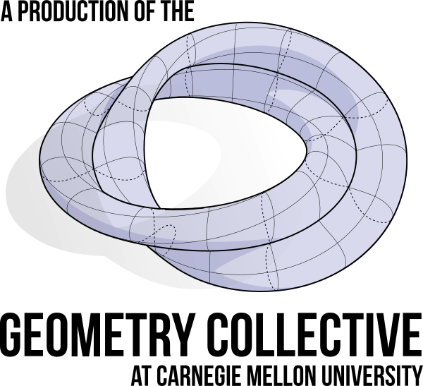
</a>
</p>
